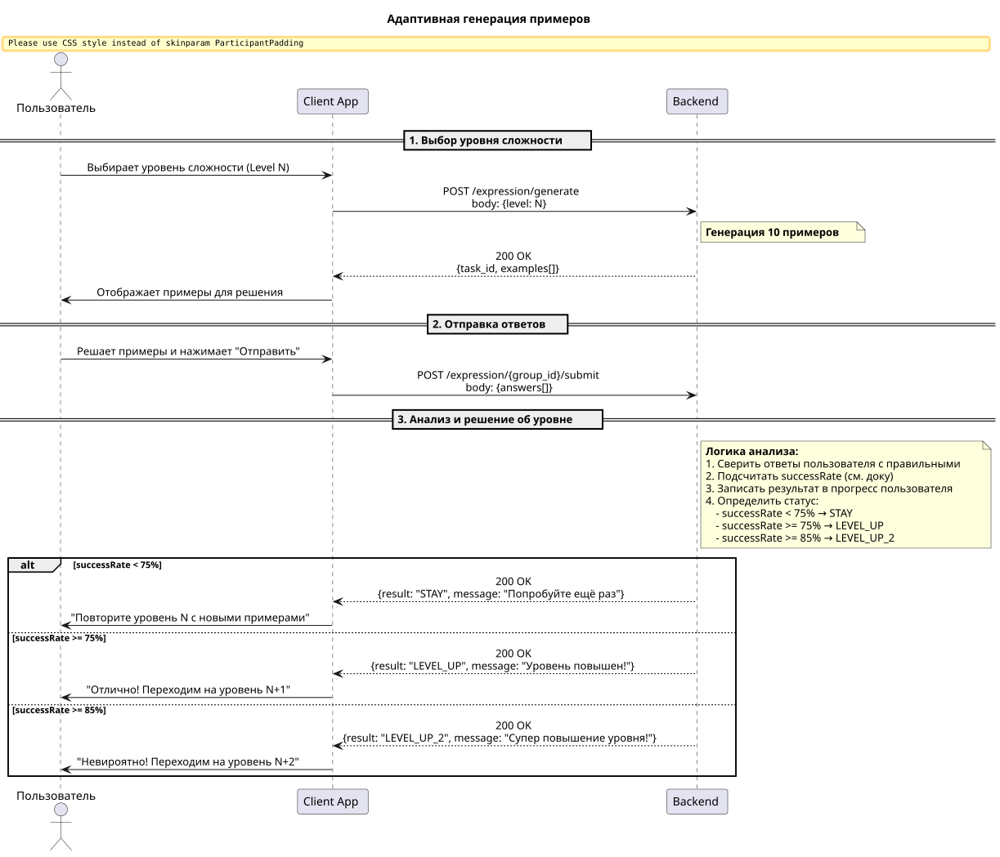

## Как пользователь хочу получать постепенно усложняющиеся примеры

### Короткое описание

Пользователь будет решать группу примеров в которой будут примеры определённого уровня.
Если пользователь с ними будет справлятся примеры будут усложнятся, иначе примеры будут перегенерированы с текущей сложностью.

### Описание группы примеров

Группа примеров состоит из 10 примеров которые могут быть разного уровня сложности.
Примеры могу состоять из трёх разных уровней, например:
    - 2 примеров прошлого уровня
    - 6 примеров текущего
    - 2 примера следующего уровня

#### Алгоритм перехода
где:
 - cN - цифровое определение сложности;
 - xN - количество примеров.

1. Переходим дальше если (с0 * x0 +  с1 * x1 + с2 * x2) / 7,5 >= с1
  - ! Если ни один пример с сложностью с0 не решён, это знак что нужно откатится на ступень ниже
2. Переход на два шага вперёд если (с0 * x0 +  с1 * x1 + с2 * x2) / 8,5 >= с1, и все x0 примеры решены

 - Пример группы примеров:

 | x0 | x1 | x2 | Сложность примеров x1 |
 |----|----|----|-----------------------|
 | 0  | 10 | 0  | 1                     |
 | 0  | 8  | 2  | 1                     |
 | 0  | 6  | 4  | 1                     |
 | 4  | 6  | 0  | 2                     |
 | 2  | 8  | 0  | 2                     |
 | 0  | 10 | 0  | 2                     |
 | 0  | 8  | 2  | 2                     |

### Логика

